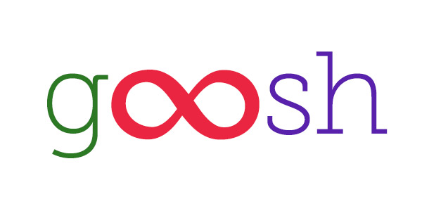

### Android Titanium module to work easily with Google Cloud Messaging push notification service

## Install the module

Unzip the latest release in your module directory and add to tiapp modules, or just type:

```
gittio install ti.goosh
```

## Set the sender ID

In your tiapp.xml, insert

```xml
<property name="gcm.senderid">YOUR_SENDER_ID</property>
```

To get GCM sender ID:

* Open the Google Developers Console.
* If you haven't created an API project yet, click Create Project.
* Find your API project and click Project Name.
* You can find Project Number. You will use it as the GCM sender ID.

## Register for Push notifications

We kept the same syntax of `Ti.Network` for iOS notifications, hope you like this choice :)

The behaviour is the same of iOS:

* if the app is in **background**, the standard OS view for incoming notifications is shown. If you click on that banner, the callback is invoked with the notification payload + the property `inBackground = true`.
* if the app is in **foreground**, nothing is shown and you have to handle manually in the app (you can anyway override this behaviour).

```js
var TiGoosh = require('ti.goosh');
TiGoosh.registerForPushNotifications({


	// The callback to invoke when a notification arrives.
	callback: function(e) {
	
		var data = JSON.parse(e.data || '');
	
	},

	// The callback invoked when you have the device token.
	success: function(e) {

		// Send the e.deviceToken variable to your PUSH server
		Ti.API.log('Notifications: device token is ' + e.deviceToken);

	},

	// The callback invoked on some errors.
	error: function(err) {
		Ti.API.error('Notifications: Retrieve device token failed', err);
	}
});
```

## Unregister

*Not currently implemented*

```js
TiGoosh.unregisterForPushNotifications();
```

## Properties

Property | Type | Description
--- | ---| --- | ----
remoteNotificationsEnabled | Boolean | Check if the notifications are active.
remoteDeviceUUID | String | Get the device token previously obtained.

## Set the badge

*Due system limitations, currently the badge over the icon is supported only on Samsung and Sony devices. This is why there's no an "Android official method" to draw that badge, but only via private API.*

```js
gcm.setAppBadge(2);
```

## Set the icon for the tray

The module sets the notification tray icon taking it from `/platform/android/res/drawable-*`.

It should be flat (no gradients), white and face-on perspective. You have to generate the icon with all resolutions.

```
22 × 22 area in 24 × 24 (mdpi)
33 × 33 area in 36 × 36 (hdpi)
44 × 44 area in 48 × 48 (xhdpi)
66 × 66 area in 72 × 72 (xxhdpi)
88 × 88 area in 96 × 96 (xxxhdpi)
```

You can use this script to generate it once you put the icon in `drawable-xxxhdpi/notificationicon.png`.

```sh
#!/bin/sh

ICON_SOURCE="app/platform/android/res/drawable-xxxhdpi/notificationicon.png"
if [ -f "$ICON_SOURCE" ]; then
	mkdir -p "app/platform/android/res/drawable-xxhdpi"
	mkdir -p "app/platform/android/res/drawable-xhdpi"
	mkdir -p "app/platform/android/res/drawable-hdpi"
	mkdir -p "app/platform/android/res/drawable-mdpi"
	convert "$ICON_SOURCE" -resize 72x72 "app/platform/android/res/drawable-xxhdpi/notificationicon.png"
	convert "$ICON_SOURCE" -resize 48x48 "app/platform/android/res/drawable-xhdpi/notificationicon.png"
	convert "$ICON_SOURCE" -resize 36x36 "app/platform/android/res/drawable-hdpi/notificationicon.png"
	convert "$ICON_SOURCE" -resize 24x24 "app/platform/android/res/drawable-mdpi/notificationicon.png"
else
	echo "No notificationicon.png found"
fi
```

## Send the notification from your server

All properties must be wrapper with a `data` object.

The payload of the notification is compatible with *Parse server*.

Property | Type | Default | Description
--- | ---| --- | ----
alert | String | `null` | The message to show in the notification center and in the status bar. 
title | String | The app name | The title to show in the notification center.
vibrate | Boolean | `false` | Control the vibration of the phone.
badge | Number | `null` | The icon on the launchscreen will display this number on the right-top corner if supported.
icon | String | The app small icon | A URL represting a large icon to show. 
color | String | `null` | Background color of the notification icon
tag | String | `null` | Tag of this notification.
id | Number | `null` | ID of this notification.
force_show_in_foreground | Boolean | `false` | Control if notification must be shown as alert even if app is in foreground.

Notes:

* If `alert` is not present, no message is shown in the notification center.
* The pair (`tag`, `id`) identifies this notification from your app to the system, so that pair should be unique within your app. If you call one of the notify methods with a (tag, id) pair that is currently active and a new set of notification parameters, it will be updated.

## A PHP Example

```php
<?php

define('GOOGLE_KEY', '');

$json = '{
  "registration_ids": ["DEVICETOKEN1", "DEVICETOKEN2"],
  "data":{
    "data": {
      "alert": "Alert",
      "title": "Title",
      "vibrate": true,
      "sound": "default",
      "badge": 1,
      "tag": "APP",
      "id": 1,
      "force_show_in_foreground": false,
      "data": {
			"foo" : "bar"
   	}
    }
  }
}';

$ch = curl_init();
curl_setopt($ch, CURLOPT_URL, 'https://android.googleapis.com/gcm/send');
curl_setopt($ch, CURLOPT_POST, true);
curl_setopt($ch, CURLOPT_HTTPHEADER, [ 'Authorization: key=' . GOOGLE_KEY, 'Content-Type: application/json' ]);
curl_setopt($ch, CURLOPT_RETURNTRANSFER, true);
curl_setopt($ch, CURLOPT_SSL_VERIFYPEER, false);
curl_setopt($ch, CURLOPT_IPRESOLVE, CURL_IPRESOLVE_V4);
curl_setopt($ch, CURLOPT_POSTFIELDS, $json);
echo curl_exec($ch);
curl_close($ch);
```

## Handle the notification on the app

The payload of the notifications is the same that comes from your server. You have to JSON parse the `data` object on the javascript side. The object passed in the `callback` contain also:

#### inBackground

A boolean value indicating if the notification has come when the app was in background, and the user has explicited clicked on the banner.

## LICENSE

MIT.

